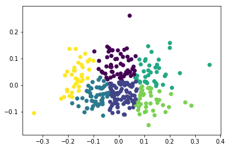
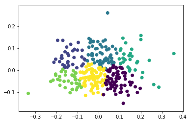
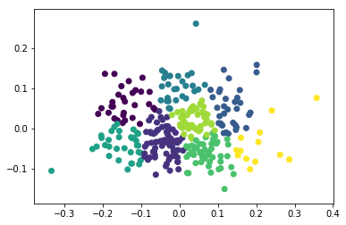
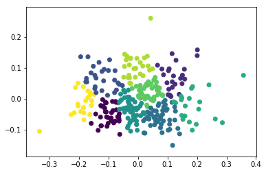
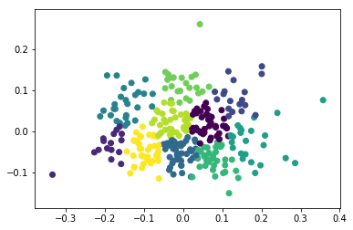

```python
import numpy as np
import pandas as pd
import scipy
import matplotlib.pyplot as plt
import seaborn as sns
from sklearn.cluster import KMeans
from sklearn.preprocessing import normalize
from sklearn.decomposition import PCA
from sklearn.cluster import MiniBatchKMeans
%matplotlib inline
```


```python
df = pd.read_csv("https://raw.githubusercontent.com/Thinkful-Ed/data-201-resources/master/cleveland.csv", header=None, error_bad_lines=False)

# Define the features and the outcome.
X = df.iloc[:, :13]
y = df.iloc[:, 13]

# Replace missing values (marked by ?) with a 0.
X = X.replace(to_replace='?', value=0)

# Binarize y so that 1 means heart disease diagnosis and 0 means no diagnosis.
y = np.where(y > 0, 0, 1)
```


```python
# Normalize the data.
X_norm = normalize(X)

# Reduce it to two components.
X_pca = PCA(2).fit_transform(X_norm)

# Calculate predicted values.
y_pred = KMeans(n_clusters=2, random_state=42).fit_predict(X_pca)

# Plot the solution.
plt.scatter(X_pca[:, 0], X_pca[:, 1], c=y_pred)
plt.show()

# Check the solution against the data.
print('Comparing k-means clusters against the data:')
print(pd.crosstab(y_pred, y))
```


    Comparing k-means clusters against the data:
    col_0   0   1
    row_0        
    0      84  65
    1      55  99
    


```python
# Each batch will be made up of 200 data points.
minibatchkmeans = MiniBatchKMeans(
    init='random',
    n_clusters=2,
    batch_size=200)
minibatchkmeans.fit(X_pca)

# Add the new predicted cluster memberships to the data frame.
predict_mini = minibatchkmeans.predict(X_pca)

# Check the MiniBatch model against our earlier one.
print('Comparing k-means and mini batch k-means solutions:')
print(pd.crosstab(predict_mini, y_pred))
```

    Comparing k-means and mini batch k-means solutions:
    col_0    0    1
    row_0          
    0      149    5
    1        0  149
    


```python
print(X_pca)
```

    [[ 3.40764155e-02  4.40729765e-02]
     [-1.31784621e-01  1.17533199e-01]
     [-3.22087207e-02  2.82864281e-02]
     [ 5.68019399e-02 -8.33107503e-02]
     [ 1.26997790e-01 -3.98473939e-02]
     [ 6.01902923e-02 -7.07767929e-02]
     [-1.72278891e-02 -2.48203394e-03]
     [-1.58131082e-01 -7.90548581e-02]
     [-2.92134765e-02  3.33816536e-03]
     [ 1.04581018e-01  3.06645898e-02]
     [ 1.16375294e-01  5.50288678e-02]
     [-7.56249202e-02 -8.56366842e-03]
     [-4.51559789e-02  3.60629385e-03]
     [-4.72738867e-03 -8.28030122e-02]
     [ 1.57299420e-01  9.53731857e-02]
     [ 2.40664153e-01  4.47907345e-02]
     [ 4.24931824e-02 -8.58228516e-02]
     [ 3.64806109e-02  2.81300275e-03]
     [-8.63473412e-02 -8.43391864e-03]
     [-3.49999241e-03 -5.33763816e-02]
     [ 3.00893722e-02 -2.00507513e-02]
     [-2.97760806e-02  5.27677894e-03]
     [-6.56412379e-02 -5.65214419e-02]
     [ 8.74878450e-02 -2.63490239e-02]
     [ 3.54083755e-02  5.52165867e-02]
     [ 5.32238672e-02 -3.80889886e-02]
     [-1.23848075e-01 -8.67035417e-02]
     [-2.61401555e-02  1.30226433e-01]
     [ 5.10178255e-02 -6.43522183e-03]
     [ 6.04021286e-02  4.14652578e-02]
     [ 1.97736169e-02  3.28145359e-02]
     [ 3.21746667e-02 -4.22599778e-02]
     [-1.23159812e-01 -2.38146225e-02]
     [ 4.45670663e-02 -2.86289577e-03]
     [ 7.66122047e-02 -5.93581511e-02]
     [ 9.87827038e-02 -3.30494643e-02]
     [ 6.25941636e-02  5.42058094e-02]
     [-1.21774595e-01  8.83524415e-02]
     [-2.03411047e-01 -1.72897077e-02]
     [-8.87248932e-03  7.00212825e-02]
     [-2.42640321e-02  1.30635500e-01]
     [ 1.60346471e-01 -2.29697371e-02]
     [-4.84338105e-02  2.80745209e-02]
     [ 9.84667568e-02  5.15278816e-02]
     [-1.06144624e-01 -5.85255638e-02]
     [ 3.74649635e-02 -6.51829874e-02]
     [ 6.48034595e-02  2.82074098e-02]
     [-3.06154156e-02  7.60152284e-02]
     [-2.15507551e-01 -4.47889647e-02]
     [ 1.02256433e-01  1.33667622e-02]
     [ 1.07695671e-01 -9.85533270e-02]
     [ 1.16451354e-01  3.69275166e-02]
     [-1.00960485e-01 -7.90998175e-02]
     [ 1.24884962e-01 -6.86459182e-02]
     [-3.44492627e-02  5.78927263e-03]
     [-1.44981524e-01  3.89550616e-02]
     [ 5.45131358e-02 -2.91965308e-03]
     [ 1.59216939e-01 -5.55041261e-02]
     [-5.94524667e-02 -3.33826993e-02]
     [-5.19859052e-03  4.05945751e-02]
     [-1.25631230e-01 -2.16871494e-02]
     [ 1.81523756e-01  3.38090673e-02]
     [ 7.79519364e-03  4.32065850e-02]
     [-6.31177497e-02 -4.85313181e-02]
     [ 1.72498172e-02  7.46242007e-02]
     [-7.28283676e-02  2.83155839e-02]
     [ 1.49481582e-01  4.89367625e-02]
     [ 7.09606677e-02  2.16005954e-02]
     [-1.16193635e-01  5.78835360e-02]
     [ 3.42592702e-02  4.51548456e-02]
     [-2.75482999e-02  5.05829574e-02]
     [ 2.33331835e-04 -3.02235597e-02]
     [-1.73118725e-01  5.44891440e-02]
     [-1.52312438e-02 -5.77695217e-02]
     [ 1.35294305e-01 -9.57088541e-02]
     [-1.47803098e-01  1.39827078e-02]
     [-5.57528484e-02 -3.10780354e-03]
     [-1.19495750e-01 -2.42326576e-03]
     [ 5.44896760e-02 -6.09220574e-02]
     [-1.14182906e-01  9.50701192e-02]
     [ 3.63647467e-02 -6.45524734e-02]
     [-5.79260551e-02 -5.04626397e-03]
     [-6.37622849e-02 -7.16343389e-02]
     [-7.20751054e-03  9.82318628e-02]
     [-1.04768653e-01 -8.87823498e-02]
     [ 8.38560188e-02 -3.78145263e-02]
     [-1.00181731e-02 -1.04856308e-02]
     [-3.26116455e-02  6.82020186e-02]
     [ 4.45239466e-02 -5.44058043e-04]
     [-3.08716695e-02 -1.33041679e-02]
     [-1.10457942e-01 -4.17597851e-02]
     [ 2.00862683e-01  1.39407693e-01]
     [ 1.34527451e-02  1.57034858e-02]
     [ 2.86096527e-01 -7.69202973e-02]
     [ 3.17307282e-02 -2.50243978e-02]
     [-5.24517289e-03 -3.53721047e-02]
     [-3.50032216e-02 -3.40844839e-02]
     [ 4.53999650e-03  2.73079857e-02]
     [ 1.09735082e-01  8.98213504e-03]
     [ 1.07307592e-01 -8.20727878e-02]
     [ 2.02987434e-02 -1.10195925e-01]
     [ 1.74198864e-01 -7.50123683e-02]
     [-8.94618597e-02 -4.47111275e-02]
     [-1.07551254e-01 -1.30268773e-02]
     [ 8.30270299e-02  1.29928787e-02]
     [-1.25245625e-01 -8.69763626e-02]
     [ 1.84957128e-01  3.94223540e-02]
     [ 2.35410775e-02 -5.59823117e-04]
     [-6.69564436e-02 -1.30902982e-02]
     [ 7.54141325e-03 -2.30039842e-02]
     [-1.02941060e-01  1.13505870e-02]
     [-3.33335919e-02 -8.49269666e-03]
     [ 1.97671637e-01 -8.23014568e-02]
     [-1.84286929e-01 -2.83509797e-02]
     [-1.58692463e-01  8.38372310e-02]
     [ 4.49800896e-02  4.86870745e-02]
     [ 1.07712333e-01  1.23973522e-02]
     [ 2.05755796e-01 -3.34698478e-02]
     [-1.76686298e-01 -6.19640476e-03]
     [-6.73765214e-02  5.10111860e-02]
     [-2.91886369e-02 -1.73738484e-02]
     [-2.02504923e-01 -2.31995805e-02]
     [-1.10128119e-02 -6.50503218e-02]
     [-2.90214473e-02  1.09445089e-01]
     [-1.52966587e-02 -3.08110138e-02]
     [ 6.65136122e-02 -5.23919635e-02]
     [-4.50428307e-02  1.43893179e-01]
     [-7.43556124e-02 -1.12436402e-02]
     [ 7.62813468e-02 -6.54443122e-02]
     [ 9.27975945e-02 -1.90020799e-02]
     [-4.92258846e-02 -3.10000344e-02]
     [-2.34757124e-03 -1.01238446e-01]
     [ 1.84123710e-01 -1.00936675e-01]
     [ 4.49889848e-02 -4.94319793e-02]
     [ 8.33081397e-02 -5.02603409e-02]
     [ 1.18948017e-02 -1.45081415e-02]
     [ 1.15713731e-01  1.45632046e-01]
     [-1.84539501e-01  3.90756832e-02]
     [ 3.32039840e-02  8.40739548e-03]
     [ 2.12720770e-02 -4.78924819e-02]
     [ 8.33963786e-02  9.86431173e-03]
     [-2.43204808e-02  4.91670304e-02]
     [ 1.48305056e-01 -5.37679560e-02]
     [-1.56451739e-01 -5.95109093e-03]
     [-1.52520377e-02 -6.84402323e-02]
     [-2.44970841e-02 -7.10129280e-02]
     [-9.98047282e-02  9.13961453e-02]
     [ 2.37146463e-02 -1.10757245e-01]
     [-7.75349919e-02 -7.19780191e-02]
     [-1.34756763e-01 -1.01699174e-01]
     [-2.28807881e-02 -2.43066238e-02]
     [-1.43052043e-01 -4.89553477e-02]
     [-3.33302487e-01 -1.04988749e-01]
     [-6.33704170e-02  4.66708016e-02]
     [-1.45979467e-01  7.58921138e-02]
     [-2.11474512e-01  3.63046868e-02]
     [-4.52400857e-02 -4.29185940e-02]
     [-6.40068135e-02 -6.55247308e-02]
     [-3.99676939e-02 -2.87427995e-02]
     [-7.29695345e-02 -3.53541433e-02]
     [ 7.89854699e-02 -8.22176110e-02]
     [-8.42704717e-02 -3.76700356e-02]
     [ 5.42645905e-02 -5.78895041e-02]
     [-1.12588518e-01 -3.01500895e-02]
     [ 1.89491617e-02 -7.05554892e-02]
     [ 1.15465953e-01 -1.13926150e-02]
     [ 8.65269047e-02 -1.16104510e-02]
     [-6.26000813e-02 -3.39865473e-02]
     [-6.84805372e-02 -5.79524832e-02]
     [ 1.48595454e-01  3.09696553e-03]
     [-9.61070741e-02  1.26049101e-01]
     [-4.55843795e-02  1.04504346e-01]
     [ 1.65802300e-02  1.05730109e-01]
     [-1.93640260e-01 -4.11828206e-02]
     [ 3.92952152e-02  9.26025308e-02]
     [-1.69227472e-01  1.35517066e-01]
     [-1.49360612e-02 -5.31524274e-02]
     [ 2.18068702e-02  1.32191446e-01]
     [-1.01708490e-01 -6.04475347e-02]
     [ 3.90832762e-02 -4.54743776e-02]
     [-3.40280953e-02 -6.24278823e-02]
     [-2.26419945e-01 -5.08501234e-02]
     [ 6.86499433e-02 -2.16980347e-02]
     [-1.33299958e-02  9.73216110e-02]
     [-5.85909104e-02  1.51811834e-02]
     [ 1.73943869e-01  1.22185907e-03]
     [ 8.19721158e-02 -1.09279249e-01]
     [-3.96964464e-02  1.25498864e-01]
     [ 6.62258799e-02  3.75472149e-02]
     [-1.95993818e-02  3.37139134e-02]
     [ 1.27543000e-01 -1.29128529e-02]
     [-1.46114246e-01  3.29687422e-02]
     [-2.62880492e-02 -1.96392977e-03]
     [-1.74392854e-01  6.57204154e-02]
     [-2.85931535e-02  6.80243710e-02]
     [-1.82899324e-01 -4.48212095e-02]
     [ 7.78956102e-03  1.16904876e-01]
     [ 2.20614771e-02  4.05566519e-03]
     [ 9.36457994e-03 -5.45053867e-02]
     [-7.75162495e-02  9.08763623e-02]
     [-2.72356618e-02 -7.72453004e-02]
     [-7.90438853e-02  6.03328152e-02]
     [ 3.57416845e-01  7.58393593e-02]
     [-1.41736695e-01  2.00287879e-02]
     [ 6.63889353e-02 -7.41521387e-02]
     [-1.09955057e-01 -1.07315767e-02]
     [-7.91224883e-02  1.99764713e-02]
     [ 4.94219536e-02  9.67044306e-02]
     [-2.82706090e-02 -2.16602123e-02]
     [ 2.53120047e-02  4.10449286e-02]
     [ 8.65798459e-02 -7.12795476e-02]
     [ 7.64091652e-02 -9.34229861e-02]
     [ 9.52344243e-02 -3.71152800e-02]
     [ 1.05825420e-01  9.68951579e-02]
     [ 2.54536380e-02 -6.41590822e-02]
     [ 1.24479994e-01 -2.62764086e-02]
     [ 1.02515964e-01 -1.01170963e-01]
     [ 8.16063245e-03  1.61921009e-03]
     [-1.61540375e-01  2.04957704e-02]
     [ 1.83259357e-02 -4.39985320e-02]
     [-2.46502212e-02 -1.04406984e-01]
     [-3.52306981e-02 -9.34367439e-02]
     [ 1.17471913e-01 -1.50011440e-01]
     [-2.02993032e-01  5.03943686e-02]
     [-3.29806393e-02 -8.76251319e-02]
     [ 1.41015491e-01 -1.13024669e-01]
     [ 4.35116426e-02 -2.91998419e-02]
     [ 2.97499360e-03  5.09519925e-03]
     [-5.26403100e-02  4.28790454e-02]
     [ 1.47102822e-03  9.83785094e-03]
     [ 1.47055527e-01 -3.28273799e-03]
     [-1.51021436e-01  1.05109074e-01]
     [ 1.58605166e-01  6.36976000e-02]
     [-1.22095889e-01  2.63395740e-02]
     [ 1.44615556e-01  6.59775095e-02]
     [-1.62075974e-01  1.16480178e-02]
     [-1.76536128e-01  5.47912269e-02]
     [-4.07949103e-02 -3.05742374e-02]
     [-2.66775432e-02 -3.26429639e-02]
     [-8.20491475e-02 -7.74990689e-02]
     [-4.96617705e-03 -7.15224699e-02]
     [-9.09207016e-02 -6.97045023e-02]
     [-2.51754666e-02 -4.23589713e-02]
     [ 9.17831620e-03  2.40004954e-02]
     [-3.29571461e-03  1.30068340e-01]
     [-1.93948838e-01  1.35648900e-01]
     [-4.14529606e-03 -8.26816095e-02]
     [-1.57245779e-01 -2.14632625e-02]
     [ 9.63559289e-02 -3.67680699e-02]
     [ 4.77284171e-02  3.43435845e-02]
     [ 7.49506619e-03  1.26761906e-02]
     [-3.77323608e-02  1.38296181e-01]
     [-1.41901357e-01  6.68410420e-02]
     [-9.06201676e-02 -6.20179074e-02]
     [-6.15299569e-02 -1.14440214e-01]
     [ 1.07604897e-01 -6.85990420e-02]
     [-5.31030724e-03 -2.92625946e-02]
     [ 3.18804149e-02  1.37348948e-01]
     [ 7.84649256e-03  7.98938299e-02]
     [-6.28089521e-02 -1.01862707e-02]
     [-1.86412028e-02 -4.36656630e-02]
     [-1.18062541e-01 -2.29993887e-02]
     [ 6.72624165e-02  1.28408482e-02]
     [ 6.09183141e-02 -6.58485064e-02]
     [ 1.28972161e-01  1.24365448e-01]
     [-1.69516206e-01  3.89200668e-03]
     [ 9.20352250e-02 -4.71551902e-03]
     [ 8.44355091e-03  3.18480504e-02]
     [ 1.21770543e-01 -9.74269000e-03]
     [ 1.39825952e-01  1.44729709e-02]
     [ 5.84591686e-02  6.90633728e-02]
     [ 3.45707012e-02  1.06110964e-01]
     [-1.69225085e-01  2.50505552e-02]
     [ 1.50704752e-01  7.62122870e-02]
     [ 1.11967294e-01  7.59087623e-03]
     [ 8.12059368e-02  9.60181193e-02]
     [-4.38228000e-02  2.15632287e-02]
     [ 5.50921182e-02  5.87501563e-03]
     [ 7.30577993e-02  3.48287050e-02]
     [ 5.39371942e-02  6.05752770e-02]
     [-1.83117632e-01 -6.80961535e-02]
     [ 3.66210198e-02 -6.30274396e-02]
     [ 2.97287165e-02  4.90295516e-02]
     [ 1.52284764e-01 -6.65684338e-02]
     [ 1.25841408e-01  4.73247510e-02]
     [-1.63230927e-01 -5.02354399e-02]
     [ 6.63182706e-02  1.08288396e-01]
     [ 2.61585467e-02  8.26366243e-03]
     [ 7.10260477e-02 -1.55176835e-02]
     [ 3.32998765e-02 -5.80257624e-02]
     [ 8.66552244e-02  7.76739061e-02]
     [-1.26757328e-01 -5.88651022e-02]
     [ 1.45815572e-01  8.21353833e-03]
     [ 1.20464138e-01  7.36245478e-02]
     [ 5.99113709e-02  3.99773157e-02]
     [ 2.61941143e-01 -6.48428827e-02]
     [ 4.30038669e-02  2.60093985e-01]
     [-4.82563354e-02  6.99617684e-02]
     [-1.07190618e-01 -4.21042898e-02]
     [ 1.03465260e-01  9.07317265e-02]
     [ 2.01295090e-01  1.57749205e-01]
     [ 6.19610847e-02 -3.93833809e-02]
     [ 2.09339259e-01 -1.00395263e-02]]
    


```python
pred = list()
accuracy = list()
best = 0
it = 0
for i in range(9):
    k = i + 2
    X_pca = PCA(k).fit_transform(X_norm)

    y_pred = KMeans(n_clusters=k).fit_predict(X_pca)


    plt.scatter(X_pca[:, 0], X_pca[:, 1], c=y_pred)
    plt.show()

    print('Comparing k-means clusters against the data:')
    conf = pd.crosstab(y_pred, y)
    pred.append(conf)
    this_acc = (conf[1][0] + conf[0][1])**2
    accuracy.append(this_acc)
    if (this_acc > best):
        best = this_acc
        it = i
    print(str(i) + " " + str(this_acc))

print(":: " + str(it) + " " + str(best))
print(pred[it])
    
```


    Comparing k-means clusters against the data:
    0 33489
    


    Comparing k-means clusters against the data:
    1 9409
    


    Comparing k-means clusters against the data:
    2 4624
    


    Comparing k-means clusters against the data:
    3 9604
    


    Comparing k-means clusters against the data:
    4 1296
    


    Comparing k-means clusters against the data:
    5 1681
    


    Comparing k-means clusters against the data:
    6 5041
    


    Comparing k-means clusters against the data:
    7 529
    


    Comparing k-means clusters against the data:
    8 1936
    :: 0 33489
    col_0   0   1
    row_0        
    0      55  99
    1      84  65
    


```python
plt.plot(accuracy)
```


    [<matplotlib.lines.Line2D at 0x141cfcd0>]


```python
pred2 = list()
accuracy2 = list()
best2 = 0
it2 = 0
for i in range(9):
    k = i + 2
    X_pca = PCA(k).fit_transform(X_norm)

    y_pred = KMeans(n_clusters=k).fit_predict(X_pca)


    plt.scatter(X_pca[:, 0], X_pca[:, 1], c=y_pred)
    plt.show()

    print('Comparing k-means clusters against the data:')
    conf = pd.crosstab(y_pred, y)
    pred2.append(conf)
    this_acc2 = (conf[1][0] + conf[0][1])**2
    accuracy2.append(this_acc2)
    if (this_acc2 > best2):
        best2 = this_acc2
        it2 = i
    print(str(i) + " " + str(this_acc2))

print(":: " + str(it2) + " " + str(best2))
print(pred2[it2])
    
```


    Comparing k-means clusters against the data:
    0 33489
    


    Comparing k-means clusters against the data:
    1 5625
    


    Comparing k-means clusters against the data:
    2 11236
    


    Comparing k-means clusters against the data:
    3 1764
    


    Comparing k-means clusters against the data:
    4 2809
    


    Comparing k-means clusters against the data:
    5 2704
    


    Comparing k-means clusters against the data:
    6 1521
    


    Comparing k-means clusters against the data:
    7 484
    


    Comparing k-means clusters against the data:
    8 1225
    :: 0 33489
    col_0   0   1
    row_0        
    0      55  99
    1      84  65
    


```python
plt.plot(accuracy2)
```


    [<matplotlib.lines.Line2D at 0x181fed0>]


```python
pred3 = list()
accuracy3 = list()
best3 = 0
it3 = 0
jt3 = 0
for i in range(9):
    k = i + 2
    pred3.append(list())
    accuracy3.append(list())
    for j in range(9):
        h = j + 2
        X_pca = PCA(h).fit_transform(X_norm)

        y_pred = KMeans(n_clusters=k).fit_predict(X_pca)


        plt.scatter(X_pca[:, 0], X_pca[:, 1], c=y_pred)
        plt.show()

        print('Comparing k-means clusters against the data:')
        conf = pd.crosstab(y_pred, y)
        pred3[i].append(conf)
        this_acc3 = (conf[1][0] + conf[0][1])**2
        accuracy3[i].append(this_acc3)
        if (this_acc3 > best3):
            best3 = this_acc3
            it3 = i
            jt3 = j
        print(str(i) + " " + str(h) + " " + str(this_acc3))

print(":: " + str(it3) + " " + " " + str(jt3) + " " + str(best3))
print(pred2[it3][jt3])
    
```


    Comparing k-means clusters against the data:
    0 2 33489
    


    Comparing k-means clusters against the data:
    0 3 33489
    


    Comparing k-means clusters against the data:
    0 4 33489
    


    Comparing k-means clusters against the data:
    0 5 33489
    


    Comparing k-means clusters against the data:
    0 6 33489
    


    Comparing k-means clusters against the data:
    0 7 33489
    


    Comparing k-means clusters against the data:
    0 8 33489
    


    Comparing k-means clusters against the data:
    0 9 33489
    


    Comparing k-means clusters against the data:
    0 10 33489
    


    Comparing k-means clusters against the data:
    1 2 15876
    


    Comparing k-means clusters against the data:
    1 3 9409
    


    Comparing k-means clusters against the data:
    1 4 12100
    


    Comparing k-means clusters against the data:
    1 5 15625
    


    Comparing k-means clusters against the data:
    1 6 3364
    


    Comparing k-means clusters against the data:
    1 7 9604
    


    Comparing k-means clusters against the data:
    1 8 15625
    


    Comparing k-means clusters against the data:
    1 9 14400
    


    Comparing k-means clusters against the data:
    1 10 9409
    


    Comparing k-means clusters against the data:
    2 2 11449
    


    Comparing k-means clusters against the data:
    2 3 3481
    


    Comparing k-means clusters against the data:
    2 4 8836
    


    Comparing k-means clusters against the data:
    2 5 1444
    


    Comparing k-means clusters against the data:
    2 6 3249
    


    Comparing k-means clusters against the data:
    2 7 1444
    


    Comparing k-means clusters against the data:
    2 8 9216
    


    Comparing k-means clusters against the data:
    2 9 4624
    


    Comparing k-means clusters against the data:
    2 10 3364
    


    Comparing k-means clusters against the data:
    3 2 3136
    


    Comparing k-means clusters against the data:
    3 3 1849
    


    Comparing k-means clusters against the data:
    3 4 2916
    


    Comparing k-means clusters against the data:
    3 5 6724
    


    Comparing k-means clusters against the data:
    3 6 3481
    


    Comparing k-means clusters against the data:
    3 7 3600
    


    Comparing k-means clusters against the data:
    3 8 7396
    


    Comparing k-means clusters against the data:
    3 9 10404
    


    Comparing k-means clusters against the data:
    3 10 8836
    





    Comparing k-means clusters against the data:
    4 2 2116
    


    Comparing k-means clusters against the data:
    4 3 1225
    





    Comparing k-means clusters against the data:
    4 4 6889
    


    Comparing k-means clusters against the data:
    4 5 3364
    


    Comparing k-means clusters against the data:
    4 6 1764
    


    Comparing k-means clusters against the data:
    4 7 7225
    


    Comparing k-means clusters against the data:
    4 8 1024
    


    Comparing k-means clusters against the data:
    4 9 2916
    


    Comparing k-means clusters against the data:
    4 10 2601
    


    Comparing k-means clusters against the data:
    5 2 2304
    


    Comparing k-means clusters against the data:
    5 3 4624
    


    Comparing k-means clusters against the data:
    5 4 3025
    


    Comparing k-means clusters against the data:
    5 5 2304
    


    Comparing k-means clusters against the data:
    5 6 1600
    


    Comparing k-means clusters against the data:
    5 7 729
    


    Comparing k-means clusters against the data:
    5 8 900
    


    Comparing k-means clusters against the data:
    5 9 2916
    


    Comparing k-means clusters against the data:
    5 10 4225
    


    Comparing k-means clusters against the data:
    6 2 3481
    


    Comparing k-means clusters against the data:
    6 3 3364
    


    Comparing k-means clusters against the data:
    6 4 1681
    


    Comparing k-means clusters against the data:
    6 5 3600
    


    Comparing k-means clusters against the data:
    6 6 625
    


    Comparing k-means clusters against the data:
    6 7 2304
    





    Comparing k-means clusters against the data:
    6 8 1521
    


    Comparing k-means clusters against the data:
    6 9 1849
    


    Comparing k-means clusters against the data:
    6 10 4624
    





    Comparing k-means clusters against the data:
    7 2 1369
    


    Comparing k-means clusters against the data:
    7 3 2025
    


    Comparing k-means clusters against the data:
    7 4 729
    


    Comparing k-means clusters against the data:
    7 5 2916
    


    Comparing k-means clusters against the data:
    7 6 1156
    


    Comparing k-means clusters against the data:
    7 7 1681
    


    Comparing k-means clusters against the data:
    7 8 1089
    


    Comparing k-means clusters against the data:
    7 9 2809
    


    Comparing k-means clusters against the data:
    7 10 2500
    


    Comparing k-means clusters against the data:
    8 2 841
    


    Comparing k-means clusters against the data:
    8 3 676
    


    Comparing k-means clusters against the data:
    8 4 2601
    


    Comparing k-means clusters against the data:
    8 5 1024
    


    Comparing k-means clusters against the data:
    8 6 1369
    





    Comparing k-means clusters against the data:
    8 7 1369
    


    Comparing k-means clusters against the data:
    8 8 961
    


    Comparing k-means clusters against the data:
    8 9 2025
    


    Comparing k-means clusters against the data:
    8 10 1369
    :: 0  0 33489
    row_0
    0    84
    1    55
    Name: 0, dtype: int64
    


```python
plt.plot(accuracy3)
```


    [<matplotlib.lines.Line2D at 0x18d9310>,
     <matplotlib.lines.Line2D at 0x18d9a10>,
     <matplotlib.lines.Line2D at 0x18d9430>,
     <matplotlib.lines.Line2D at 0x18d9930>,
     <matplotlib.lines.Line2D at 0x18d9ad0>,
     <matplotlib.lines.Line2D at 0x18d9ff0>,
     <matplotlib.lines.Line2D at 0x18d9090>,
     <matplotlib.lines.Line2D at 0x18d9370>,
     <matplotlib.lines.Line2D at 0x18d9490>]


