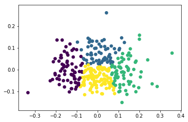

# Start

This is copied from the exercise so far.

```python
import numpy as np
import pandas as pd
import scipy
import matplotlib.pyplot as plt
import seaborn as sns
from sklearn.cluster import KMeans
from sklearn.preprocessing import normalize
from sklearn.decomposition import PCA
from sklearn.cluster import MiniBatchKMeans
%matplotlib inline
```


```python
df = pd.read_csv("https://raw.githubusercontent.com/Thinkful-Ed/data-201-resources/master/cleveland.csv", header=None, error_bad_lines=False)

# Define the features and the outcome.
X = df.iloc[:, :13]
y = df.iloc[:, 13]

# Replace missing values (marked by ?) with a 0.
X = X.replace(to_replace='?', value=0)

# Binarize y so that 1 means heart disease diagnosis and 0 means no diagnosis.
y = np.where(y > 0, 0, 1)
```


```python
# Normalize the data.
X_norm = normalize(X)

# Reduce it to two components.
X_pca = PCA(2).fit_transform(X_norm)

# Calculate predicted values.
y_pred = KMeans(n_clusters=2, random_state=42).fit_predict(X_pca)

# Plot the solution.
plt.scatter(X_pca[:, 0], X_pca[:, 1], c=y_pred)
plt.show()

# Check the solution against the data.
print('Comparing k-means clusters against the data:')
print(pd.crosstab(y_pred, y))
```


    Comparing k-means clusters against the data:
    col_0   0   1
    row_0        
    0      84  65
    1      55  99
    

This function extracts the highest values from each row.

```python
print(best(pd.crosstab(y_pred, y)))
```

    183
    


```python
# Each batch will be made up of 200 data points.
minibatchkmeans = MiniBatchKMeans(
    init='random',
    n_clusters=2,
    batch_size=200)
minibatchkmeans.fit(X_pca)

# Add the new predicted cluster memberships to the data frame.
predict_mini = minibatchkmeans.predict(X_pca)

# Check the MiniBatch model against our earlier one.
print('Comparing k-means and mini batch k-means solutions:')
print(pd.crosstab(predict_mini, y_pred))
```

    Comparing k-means and mini batch k-means solutions:
    col_0    0    1
    row_0          
    0      149    5
    1        0  149
    
From this point on I play with the data.

```python
pred = list()
accuracy = list()
b = 0
it = 0
for i in range(9):
    k = i + 2
    X_pca = PCA(k).fit_transform(X_norm)

    y_pred = KMeans(n_clusters=k).fit_predict(X_pca)


    plt.scatter(X_pca[:, 0], X_pca[:, 1], c=y_pred)
    plt.show()

    print('Comparing k-means clusters against the data:')
    conf = pd.crosstab(y_pred, y)
    pred.append(conf)
    this_acc = bester(conf)
    accuracy.append(this_acc)
    if (this_acc > b):
        b = this_acc
        it = i
    print(str(i) + " " + str(this_acc))

print(":: " + str(it) + " " + str(b))
print(pred[it])
    
```


    Comparing k-means clusters against the data:
    0 183
    


    Comparing k-means clusters against the data:
    1 180
    





    Comparing k-means clusters against the data:
    2 202
    


    Comparing k-means clusters against the data:
    3 203
    


    Comparing k-means clusters against the data:
    4 198
    


    Comparing k-means clusters against the data:
    5 195
    


    Comparing k-means clusters against the data:
    6 195
    


    Comparing k-means clusters against the data:
    7 192
    


    Comparing k-means clusters against the data:
    8 201
    :: 3 203
    col_0   0   1
    row_0        
    0      36  11
    1      16  29
    2      16  56
    3      38  24
    4      33  44
    
Iteration 2 which has 4 clusters had the highest accuracy at 202.

```python
plt.plot(accuracy)
```


    [<matplotlib.lines.Line2D at 0xe33e90>]


Allowing the number of PCA and clusters to differentiate.


```python
pred3 = list()
accuracy3 = list()
best3 = 0
it3 = 0
jt3 = 0
for i in range(9):
    k = i + 2
    pred3.append(list())
    accuracy3.append(list())
    for j in range(9):
        h = j + 2
        X_pca = PCA(h).fit_transform(X_norm)

        y_pred = KMeans(n_clusters=k).fit_predict(X_pca)

        print('Comparing k-means clusters against the data:')
        conf = pd.crosstab(y_pred, y)
        pred3[i].append(conf)
        this_acc3 = bester(conf)
        accuracy3[i].append(this_acc3)
        if (this_acc3 > best3):
            best3 = this_acc3
            it3 = i
            jt3 = j
        print(str(i) + " " + str(h) + " " + str(this_acc3))

print(":: " + str(it3) + " " + " " + str(jt3) + " " + str(best3))
print(pred3[it3][jt3])
    
```

    Comparing k-means clusters against the data:
    0 2 183
    Comparing k-means clusters against the data:
    0 3 183
    Comparing k-means clusters against the data:
    0 4 182
    Comparing k-means clusters against the data:
    0 5 183
    Comparing k-means clusters against the data:
    0 6 183
    Comparing k-means clusters against the data:
    0 7 182
    Comparing k-means clusters against the data:
    0 8 183
    Comparing k-means clusters against the data:
    0 9 183
    Comparing k-means clusters against the data:
    0 10 182
    Comparing k-means clusters against the data:
    1 2 180
    Comparing k-means clusters against the data:
    1 3 180
    Comparing k-means clusters against the data:
    1 4 180
    Comparing k-means clusters against the data:
    1 5 180
    Comparing k-means clusters against the data:
    1 6 180
    Comparing k-means clusters against the data:
    1 7 179
    Comparing k-means clusters against the data:
    1 8 180
    Comparing k-means clusters against the data:
    1 9 180
    Comparing k-means clusters against the data:
    1 10 180
    Comparing k-means clusters against the data:
    2 2 203
    Comparing k-means clusters against the data:
    2 3 202
    Comparing k-means clusters against the data:
    2 4 202
    Comparing k-means clusters against the data:
    2 5 201
    Comparing k-means clusters against the data:
    2 6 203
    Comparing k-means clusters against the data:
    2 7 202
    Comparing k-means clusters against the data:
    2 8 202
    Comparing k-means clusters against the data:
    2 9 201
    Comparing k-means clusters against the data:
    2 10 203
    Comparing k-means clusters against the data:
    3 2 200
    Comparing k-means clusters against the data:
    3 3 201
    Comparing k-means clusters against the data:
    3 4 201
    Comparing k-means clusters against the data:
    3 5 202
    Comparing k-means clusters against the data:
    3 6 201
    Comparing k-means clusters against the data:
    3 7 201
    Comparing k-means clusters against the data:
    3 8 202
    Comparing k-means clusters against the data:
    3 9 201
    Comparing k-means clusters against the data:
    3 10 201
    Comparing k-means clusters against the data:
    4 2 200
    Comparing k-means clusters against the data:
    4 3 204
    Comparing k-means clusters against the data:
    4 4 199
    Comparing k-means clusters against the data:
    4 5 203
    Comparing k-means clusters against the data:
    4 6 199
    Comparing k-means clusters against the data:
    4 7 200
    Comparing k-means clusters against the data:
    4 8 199
    Comparing k-means clusters against the data:
    4 9 197
    Comparing k-means clusters against the data:
    4 10 195
    Comparing k-means clusters against the data:
    5 2 197
    Comparing k-means clusters against the data:
    5 3 188
    Comparing k-means clusters against the data:
    5 4 189
    Comparing k-means clusters against the data:
    5 5 197
    Comparing k-means clusters against the data:
    5 6 198
    Comparing k-means clusters against the data:
    5 7 197
    Comparing k-means clusters against the data:
    5 8 199
    Comparing k-means clusters against the data:
    5 9 199
    Comparing k-means clusters against the data:
    5 10 196
    Comparing k-means clusters against the data:
    6 2 194
    Comparing k-means clusters against the data:
    6 3 195
    Comparing k-means clusters against the data:
    6 4 190
    Comparing k-means clusters against the data:
    6 5 193
    Comparing k-means clusters against the data:
    6 6 193
    Comparing k-means clusters against the data:
    6 7 189
    Comparing k-means clusters against the data:
    6 8 195
    Comparing k-means clusters against the data:
    6 9 186
    Comparing k-means clusters against the data:
    6 10 196
    Comparing k-means clusters against the data:
    7 2 201
    Comparing k-means clusters against the data:
    7 3 196
    Comparing k-means clusters against the data:
    7 4 197
    Comparing k-means clusters against the data:
    7 5 197
    Comparing k-means clusters against the data:
    7 6 199
    Comparing k-means clusters against the data:
    7 7 192
    Comparing k-means clusters against the data:
    7 8 195
    Comparing k-means clusters against the data:
    7 9 199
    Comparing k-means clusters against the data:
    7 10 192
    Comparing k-means clusters against the data:
    8 2 204
    Comparing k-means clusters against the data:
    8 3 201
    Comparing k-means clusters against the data:
    8 4 204
    Comparing k-means clusters against the data:
    8 5 198
    Comparing k-means clusters against the data:
    8 6 202
    Comparing k-means clusters against the data:
    8 7 208
    Comparing k-means clusters against the data:
    8 8 202
    Comparing k-means clusters against the data:
    8 9 206
    Comparing k-means clusters against the data:
    8 10 200
    :: 8  5 208
    col_0   0   1
    row_0        
    0      12  27
    1      17  22
    2      21   6
    3       2  17
    4      12   6
    5      28  17
    6      16  11
    7       6  30
    8      14  24
    9      11   4
    
The highest accuracy is given with 208 at iteration 8.  We have 10 clusters and 7 features.


```python
plt.plot(accuracy3)
```


    [<matplotlib.lines.Line2D at 0xf972d0>,
     <matplotlib.lines.Line2D at 0xf97dd0>,
     <matplotlib.lines.Line2D at 0xf97cd0>,
     <matplotlib.lines.Line2D at 0xe4fcb0>,
     <matplotlib.lines.Line2D at 0xe4fd50>,
     <matplotlib.lines.Line2D at 0xe4fb90>,
     <matplotlib.lines.Line2D at 0xe4fab0>,
     <matplotlib.lines.Line2D at 0xe4fad0>,
     <matplotlib.lines.Line2D at 0xe4f090>]


```python
def bester(df):
    return sum(df.max(axis=1))
    
```
